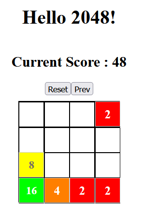

# Simple 2048

## 기능 체클 리스트
| 스펙 종류   | 내용                                              | 구현 여부 |
|------------|---------------------------------------------------|:--------:|
| **필수 스펙** | ⌨️ 방향키로 조작이 가능해야 합니다.                   | ✅ |
|            | 🛑 128 타일이 생성되면 게임이 종료됩니다.              | ✅ |
| **선택 스펙** | 💾 (하) 새로고침 시 게임판이 유지됩니다.               | ✅ |
|            | 🏆 (중) 점수가 표시됩니다.                            | ✅ |
|            | ⏪ (중) undo 버튼을 누르면 이전 턴의 상태로 돌아갑니다. | ✅ |
|            | 🎞️ (상) 블럭 이동 시 애니메이션이 나타납니다.           | ✅ |

## 구현 결과

## 배포 링크

[Hello 2048!](https://yabsed.github.io/React-Week3-Simple-2048)

